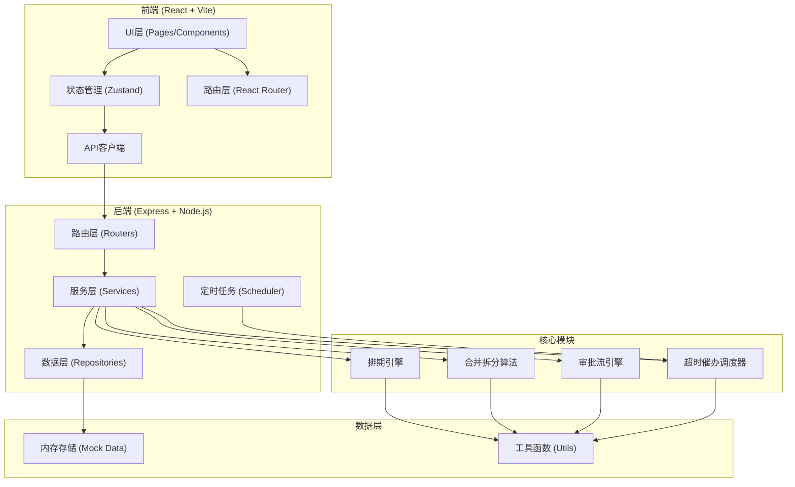
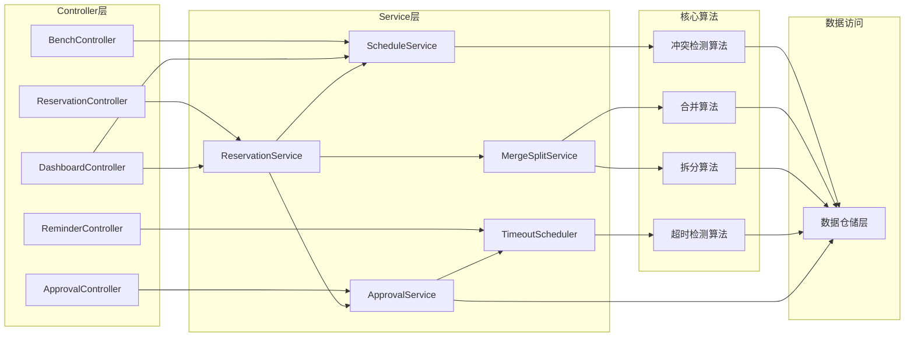
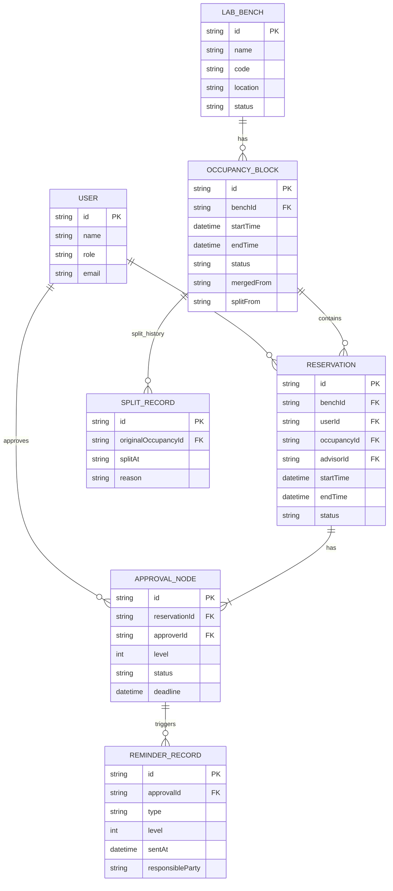

## 1. 架构设计



## 2. 技术说明
- **前端框架**: React@18 + TypeScript
- **构建工具**: Vite@5
- **状态管理**: Zustand@4
- **路由**: React Router DOM@6
- **样式方案**: TailwindCSS@3
- **图标库**: Lucide React
- **后端框架**: Express@4
- **后端语言**: TypeScript (ESM)
- **数据存储**: 内存Mock数据（含初始化种子数据）
- **定时任务**: node-cron
- **初始化模板**: react-express-ts

## 3. 路由定义

| 路由 (前端) | 页面组件 | 用途 |
|-------------|----------|------|
| / | Dashboard | 首页仪表盘：数据概览、快捷操作、待办提醒 |
| /benches | BenchList | 实验台列表：资源浏览、筛选搜索 |
| /benches/:id | BenchDetail | 实验台详情：排期日历、资源信息 |
| /reservations/new | NewReservation | 新建预约：时段选择、信息填写 |
| /reservations | MyReservations | 我的预约：列表、筛选、退订 |
| /reservations/:id | ReservationDetail | 预约详情：审批轨迹、时段展示 |
| /approvals | ApprovalCenter | 审批中心：待办列表、审批操作 |
| /reminders | ReminderCenter | 催办记录：通知列表、超时看板 |
| /admin/benches | AdminBenches | 管理后台：实验台管理 |
| /admin/rules | AdminRules | 管理后台：规则配置 |

| 路由 (后端API) | 方法 | 用途 |
|----------------|------|------|
| /api/benches | GET | 获取实验台列表 |
| /api/benches/:id | GET | 获取实验台详情 |
| /api/benches/:id/schedule | GET | 获取指定实验台排期 |
| /api/reservations | POST | 创建预约（触发合并检测） |
| /api/reservations | GET | 获取当前用户预约列表 |
| /api/reservations/:id | GET | 获取预约详情（含审批轨迹） |
| /api/reservations/:id/cancel | POST | 退订预约（触发拆分逻辑） |
| /api/approvals/pending | GET | 获取待审批列表 |
| /api/approvals/:id/approve | POST | 审批通过 |
| /api/approvals/:id/reject | POST | 审批驳回 |
| /api/approvals/:id/escalate | POST | 手动升级审批 |
| /api/reminders | GET | 获取催办记录 |
| /api/reminders/timeout-check | POST | 手动触发超时检测 |
| /api/dashboard/stats | GET | 获取仪表盘统计数据 |
| /api/admin/benches | POST/PUT/DELETE | 实验台CRUD |
| /api/admin/rules | GET/PUT | 审批规则配置 |

## 4. API类型定义

```typescript
// 用户类型
interface User {
  id: string;
  name: string;
  role: 'student' | 'advisor' | 'admin';
  email: string;
  department?: string;
  studentId?: string;
  advisorId?: string;
}

// 实验台
interface LabBench {
  id: string;
  name: string;
  code: string;
  location: string;
  building: string;
  room: string;
  category: string;
  equipment: string[];
  capacity: number;
  status: 'available' | 'maintenance' | 'disabled';
  managerId: string;
  description: string;
  imageUrl: string;
}

// 时间槽
interface TimeSlot {
  start: string; // ISO datetime
  end: string;   // ISO datetime
}

// 占用区间（合并后的）
interface OccupancyBlock {
  id: string;
  benchId: string;
  reservationIds: string[];
  startTime: string;
  endTime: string;
  status: 'pending' | 'confirmed' | 'cancelled';
  mergedFrom?: string[]; // 被合并的原始block ids
  splitFrom?: string;    // 拆分来源block id
}

// 预约单
interface Reservation {
  id: string;
  benchId: string;
  userId: string;
  userName: string;
  advisorId: string;
  advisorName: string;
  projectName: string;
  description: string;
  participants: string[];
  startTime: string;
  endTime: string;
  occupancyId: string;
  status: 'pending' | 'approved' | 'rejected' | 'cancelled' | 'completed';
  createdAt: string;
  approvalTrail: ApprovalNode[];
  splitHistory?: SplitRecord[];
}

// 审批节点
interface ApprovalNode {
  id: string;
  reservationId: string;
  approverId: string;
  approverName: string;
  role: 'advisor' | 'department_head' | 'auto';
  level: number;
  status: 'pending' | 'approved' | 'rejected' | 'timeout' | 'escalated';
  comment?: string;
  createdAt: string;
  deadline: string;
  handledAt?: string;
  reminders: ReminderRecord[];
}

// 催办记录
interface ReminderRecord {
  id: string;
  approvalId: string;
  type: 'reminder' | 'escalation' | 'auto_decision';
  level: number;
  sentAt: string;
  recipientId: string;
  recipientName: string;
  message: string;
  responsibleParty?: string; // 责任人记录
}

// 拆分记录
interface SplitRecord {
  id: string;
  originalOccupancyId: string;
  newOccupancyIds: string[];
  splitAt: string;
  reason: string;
  operatorId: string;
}

// 审批规则配置
interface ApprovalRules {
  advisorTimeoutHours: number;
  firstReminderHours: number;
  escalationHours: number;
  autoDecisionHours: number;
  escalationTargetRole: string;
  autoDecisionAction: 'approve' | 'reject';
  cancellationDeadlineHours: number;
}
```

## 5. 后端服务架构



## 6. 数据模型

### 6.1 实体关系图



### 6.2 初始化种子数据（核心部分）

- 预设3个用户角色：1名学生、1名导师、1名管理员
- 预设6个实验台（覆盖化学、生物、物理、计算机4类实验室）
- 预设5条历史预约（覆盖各种状态：已完成、审批中、已通过）
- 预设3条审批节点（含1条即将超时的催办场景）
- 预设1条合并占用记录和1条拆分历史记录
- 预设审批规则：导师审批时限24h，12h催办，24h升级，48h自动裁决
