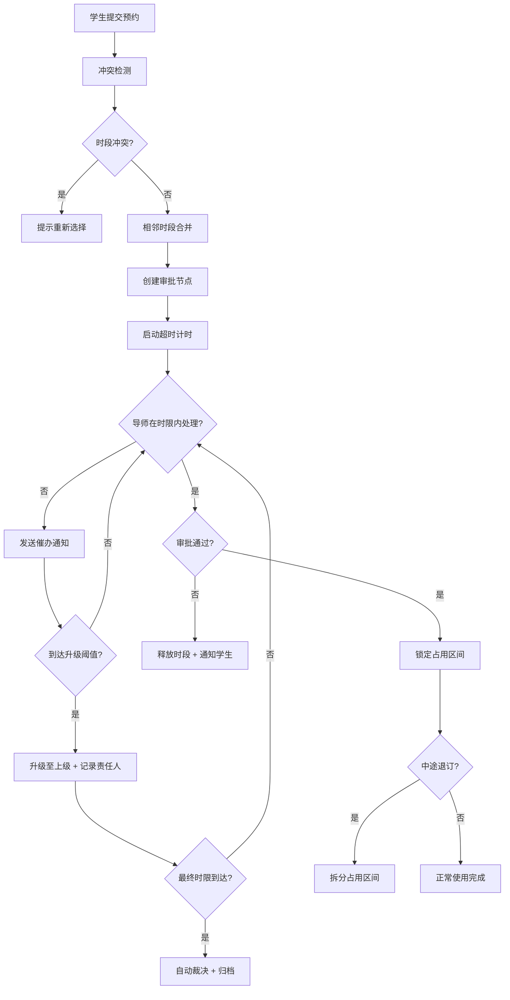

## 1. 产品概述
高校实验室预约APP是一个面向高校师生的智能化实验室资源管理系统，解决实验台预约排期混乱、审批流程低效、超时无人处理等核心问题。系统通过智能时段合并拆分、自动化审批催办，提升实验室资源利用率和管理效率。

- 目标用户：学生（预约者）、导师（审批者）、实验室管理员（资源管理）
- 核心价值：智能排期 + 自动催办 + 全流程留痕

## 2. 核心功能

### 2.1 用户角色
| 角色 | 注册方式 | 核心权限 |
|------|----------|----------|
| 学生 | 校园账号绑定 | 浏览实验台、提交预约申请、查看审批进度、退订预约 |
| 导师 | 校园账号绑定 + 职称认证 | 审批归属学生预约、接收催办通知、查看审批历史 |
| 管理员 | 系统分配 | 实验台CRUD、查看全局排期、审批流程配置、超时规则管理 |

### 2.2 功能模块
1. **实验台排期模块**：实验台资源建档、日历视图排期、时段选择、冲突检测
2. **占用合并拆分模块**：相邻时段自动合并、中途退订智能拆分、占用状态实时同步
3. **预约审批模块**：多级审批流、审批轨迹留痕、导师审批准入控制、审批意见填写
4. **超时催办模块**：节点超时计时、自动催办通知、超时升级机制、责任人记录

### 2.3 页面详情
| 页面名称 | 模块名称 | 功能描述 |
|----------|----------|----------|
| 首页仪表盘 | 数据概览 | 今日预约统计、待审批数量、超时预警、实验台利用率图表 |
| 首页仪表盘 | 快捷操作 | 新建预约、待办提醒入口、最近审批动态 |
| 实验台列表 | 资源列表 | 实验台卡片展示、筛选搜索、状态标签、详情查看 |
| 实验台详情 | 排期日历 | 周/日视图切换、时段拖拽选择、占用色块展示、合并高亮 |
| 实验台详情 | 资源信息 | 设备配置、使用须知、位置信息、负责人 |
| 新建预约 | 时段选择 | 日期时间选择器、冲突实时检测、连订合并提示 |
| 新建预约 | 信息填写 | 实验项目描述、参与人员、导师选择、附件上传 |
| 我的预约 | 预约列表 | 状态筛选、搜索、查看详情、退订操作 |
| 我的预约 | 预约详情 | 审批轨迹时间轴、占用时段展示、拆分记录 |
| 审批中心 | 待办列表 | 待审批卡片、超时标记、加急标签、批量操作 |
| 审批中心 | 审批操作 | 通过/驳回、填写意见、查看关联预约、转审 |
| 催办记录 | 通知列表 | 催办历史、升级记录、责任人、处理状态 |
| 催办记录 | 超时看板 | 超时统计图表、节点时效分析、责任人排行 |
| 管理后台 | 实验台管理 | 新增/编辑/禁用实验台、批量导入、设备配置 |
| 管理后台 | 规则配置 | 审批流设置、超时阈值配置、升级策略管理 |

## 3. 核心流程

### 3.1 预约主流程
学生选择实验台和时段 → 系统检测冲突并自动合并相邻时段 → 填写预约信息提交 → 进入导师审批节点 → 超时计时启动 → 导师审批通过/驳回 → 通过后锁定占用 → 生成审批轨迹 → 如需退订则拆分占用区间

### 3.2 超时催办流程
审批节点创建 → 超时计时器启动 → 到达第一阈值（如12h）发送催办通知 → 到达第二阈值（如24h）记录超时并升级至系主任 → 到达第三阈值（如48h）自动通过/驳回并记录责任人

## 4. 用户界面设计

### 4.1 设计风格
- **主色调**：科技蓝 `#1E40AF`（专业可信）+ 实验室绿 `#059669`（可用状态）
- **辅助色**：警示橙 `#EA580C`（催办/待处理）+ 危险红 `#DC2626`（超时/驳回）
- **中性色**：石板灰系列 `slate-50 ~ slate-900`
- **按钮风格**：圆角 `rounded-lg`、悬停阴影、按下缩放微交互
- **字体**：标题使用 `思源黑体 Bold`，正文使用 `思源黑体 Regular`，数据使用 `JetBrains Mono`
- **布局风格**：侧边导航 + 卡片式内容区，分区明确，信息层级清晰
- **图标**：Lucide 线性图标，状态使用彩色徽章

### 4.2 页面设计概述
| 页面名称 | 模块名称 | UI元素 |
|----------|----------|--------|
| 首页仪表盘 | 数据概览 | 渐变统计卡片 + 环形进度图 + 趋势折线图 + 状态色块矩阵 |
| 实验台详情 | 排期日历 | 时间轴网格 + 拖拽选区 + 渐变占用块 + 合并高亮边框动画 |
| 我的预约 | 预约详情 | 垂直审批时间轴 + 节点连接线动画 + 时段分段条 |
| 审批中心 | 待办列表 | 倒计时徽章 + 优先级色条 + 滑入式审批面板 |
| 催办记录 | 超时看板 | 热力图 + 责任人排名卡片 + 分级预警指示灯 |

### 4.3 响应式
- Desktop-first 设计，断点 `lg:1024px`、`md:768px`、`sm:640px`
- 侧边栏在移动端折叠为底部 Tab 导航
- 排期日历在移动端切换为列表视图
- 表格在移动端转为卡片堆叠展示
- 触摸目标 ≥ 44px，优化手势操作体验
